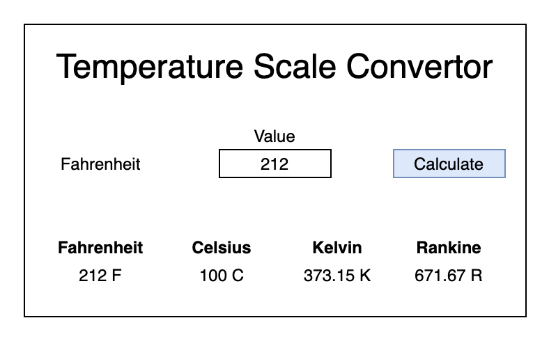
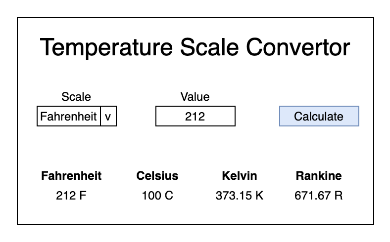

# JS DOM Lab

## Description
You will create a tool to convert temperatures from one scale to another. After completing each bullet point in the requirements, you should commit and push your changes.

## Setup
1. Fork this repository
2. Clone your repository to your local machine `git clone`
3. Open the project in your text editor
4. Create HTML, CSS, and JS files in your root
 
## Requirements

### Part 1

* The user can enter a value into the textbox
* The user can click the calculate button
* The system will convert the Fahrenheit value into Celsius
* The user can view the Celsius value 

### Part 2

* The system will convert the Fahrenheit value into Kelvin
* The system will convert the Fahrenheit value into Rankine
* The user can view the Kelvin value 
* The user can view the Rankine value 
* The user can view the Fahrenheit value 

### Part 3

* The user can select their starting scale
* The system will convert the value from the starting scall to all four scales

## Submission
Create a pull request from your project GitHub page

**Happy Hacking!**

